# Dormitory management system

This is the project of COMP2008J_2021 Group4, 
which is called the "**Dormitory management system**".

## About Our Group
*Group Members:*

Name|UCD student number|Product Owner of
:---|:---:|:---:
YouWeijiong|19206208|Sprint3
LiuZhe|19206218|Sprint4
ZhuBolun|19206215|Sprint1
DouJingyue|19206165|Sprint2
WuShichu|19206153|Sprint5

## How to Use Our Dormitory Management System
### Step 1:
#### Clone the project from Gitlab  
Gitlab repo (Clone with SSH):  
`git@csgitlab.ucd.ie:comp2008j-group4/dormitory-management-system.git`

Gitlab repo (Clone with HTTPS):  
`https://csgitlab.ucd.ie/comp2008j-group4/dormitory-management-system.git`

Using the following command (in your local terminal) to clone our project  
`git clone https://csgitlab.ucd.ie/comp2008j-group4/dormitory-management-system.git`

### Step 2:
#### Setting the required extensions into your local environment
You can do this by using the following command in your local terminal  
`pip install -r requirements.txt`

### Step 3:
#### Configure the web server before starting it
If you are using a **Windows OS**  
Using the following commands in your local terminal  
`set FLASK_APP=dms.py`  
`set FLASK_ENV=development`

If you are using a **Mac OS** or **Linux**   
Using the following commands in your local terminal  
`export FLASK_APP=dms.py`  
`export FLASK_ENV=development`

### Step 4:
#### Run our project using Flask web server
You can do this by using the following command in your local terminal  
`flask run`

Then you will get a web url like what has been shown in the following picture.  
You can just click on it then it will be accessed with your default browser.
Or you can copy it into a browser to access it.

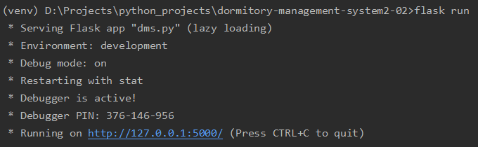
*The web URL*

### Step 5:
#### Choose a role to Login and enjoy the Dormitory Management System 
We have created some build-in accounts for quick glancing the main features of our project and also for testing.  

There are two different accounts of students, a single account for dorm administrator 
and a single account for system administrator.  

You can use these build-in accounts to log in and have a look on our project conveniently.
User ids and passwords are shown in the following table.

*Build-In Accounts:*

UserID|Password|UserRole
:---|:---:|:---:
17371101|123|Student
17371102|123|Student
A0000001|123|Dormitory Administrator
S0000001|123|System Administrator

## The Main Features in This Project
### An Overview
Dormitory management in BJUT is mainly based on paper recording and face-to-face communication at present. 
**Students** prefer a more convenient way to express their needs to managers. 
At the same time, **dormitory administrators** need to improve their data organizing ability to deal with the requests from school officers and students. 
“Dormitory management system” will solve these problems by building an effective web platform for them. 

“Dormitory management system” allows three kinds of users to use, which are **student, dorm administrator** and **system administrator**.

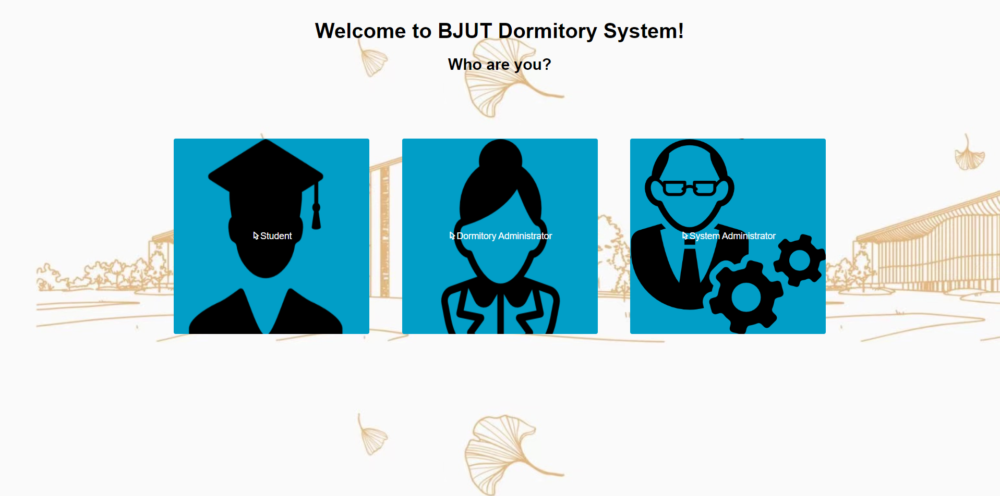
*3 different roles of users*

### Feature 1: Profile
Every user of our website has a unique profile page which contains the basic information about them.
Besides, users have access to modify some of their information like phone number, email and avatar.

*profile of a student user*

### Feature 2: Complaint + Repairing
This is the module of reporting, which is categorized into **complain report** and **repairing report**. 
Students can report the broken public facilities or unacceptable behaviors to their dormitory administrators. 
Meanwhile, the corresponding dormitory administrators can receive the message
then respond to students’ reports.

#### students' reporting:

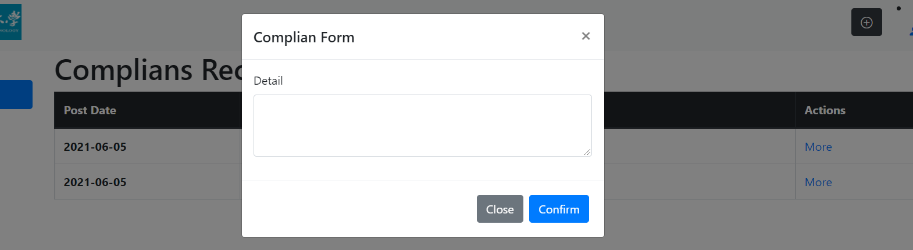
*submit the complaints*

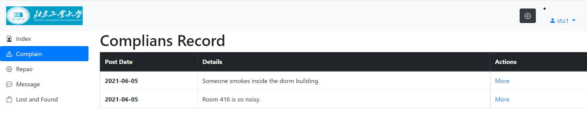
*complain records of a student user*

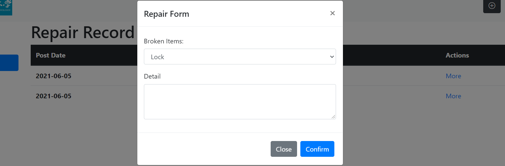
*applying for repairing*

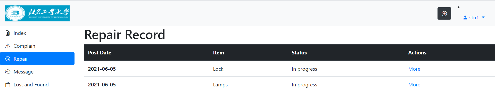
*repairing records of a student user*

#### dorm administrator's response:
Dorm administrator can reply to the repair messages and complain messages.
We will take the repairing message as an example.

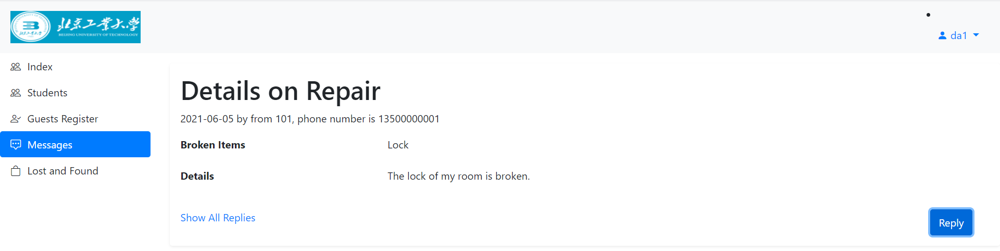
*dorm administrator checking the repairing detail*

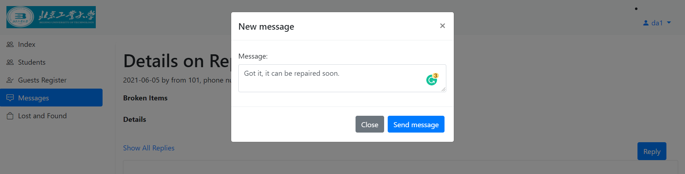
*dorm administrator replying the repairing report*

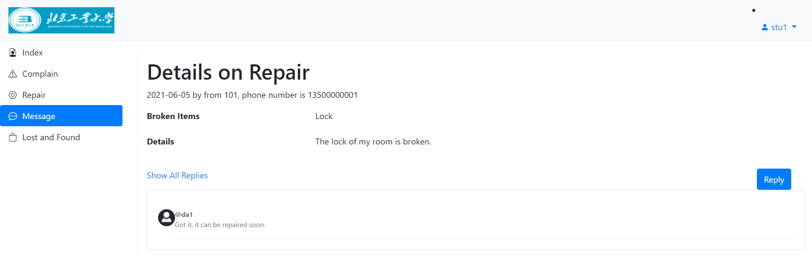
*student get the response message from dorm administrator*

### Feature 3: Message System
There is a message system in our website, which supports the communication
between students and their corresponding dorm administrators.

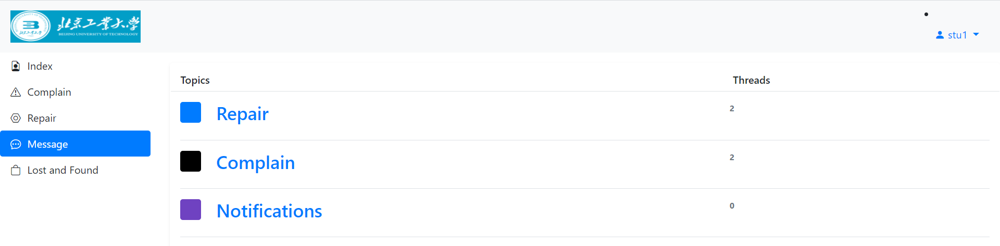
*message system*

Students and Dorm administrators can have their communications 
about repair applying and complaints in the section called 'Repair' and 'Complain' respectively.  

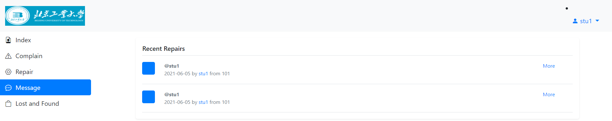
*a student's messages about repairing*

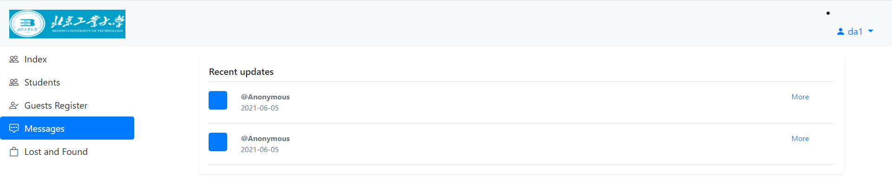
*a dorm administrator's message about complain*

Additionally, in the message system, dorm administrators can release some notifications
that only the students in the building he is managing can see.

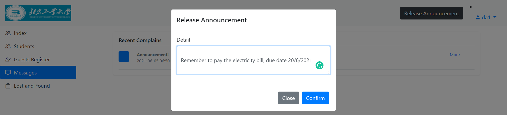 换图！
*dorm administrator release an announcement*

*corresponding students receive the announcement*

### Feature 4: Information Management System
For the details of 'management', it includes inserting new information,
deleting existing information, searching for the information using different tags,
modifying the existing information.

#### For Dorm Administrators
**Dorm administrators** are able to manage the information of students living the corresponding dorm building,
and guests in this building.

#### For System Administrators
**System administrators** are able to manage the information of all the students,
all the guests and all the dorm administrators.

The appearance of info management system of dorm administrator are shown below as examples.

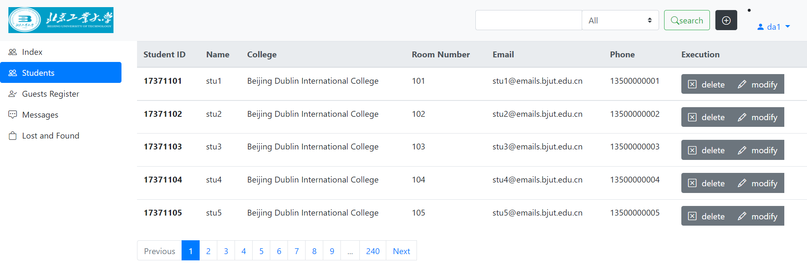
*dorm administrator check the student information*

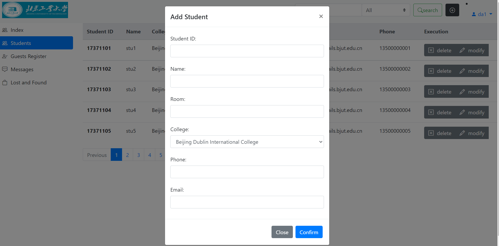
*inserting new student information*

*dorm administrator check the guest information*

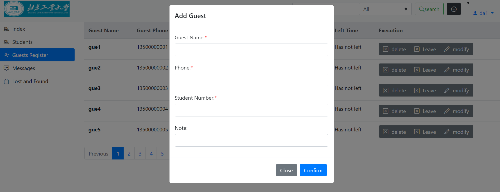
*registering new guest information*

### Feature 5: Lost & Found System
In our Lost & Found System, students can post the information of their lost items and
the items they found. The author of the information can add more pictures for it and authors are
also able to change the status of this lost item or found item.

Both students and dorm administrators are able to leave some comments below each information.
Besides, they are also able to reply to some specific comments.

System administrators have the access to delete the illegal information,
therefore it cannot be seen by anyone.

#### some basic functions are illustrated below:

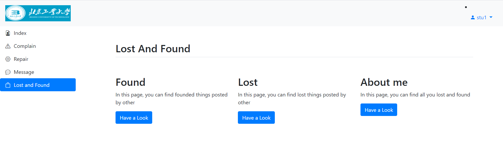
*Lost & Found System*

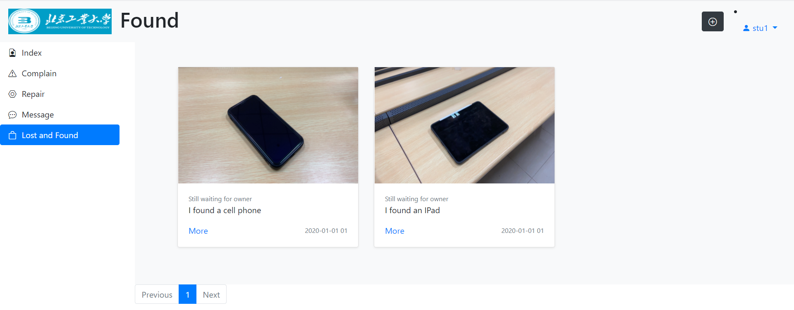
*the 'Found' Module*

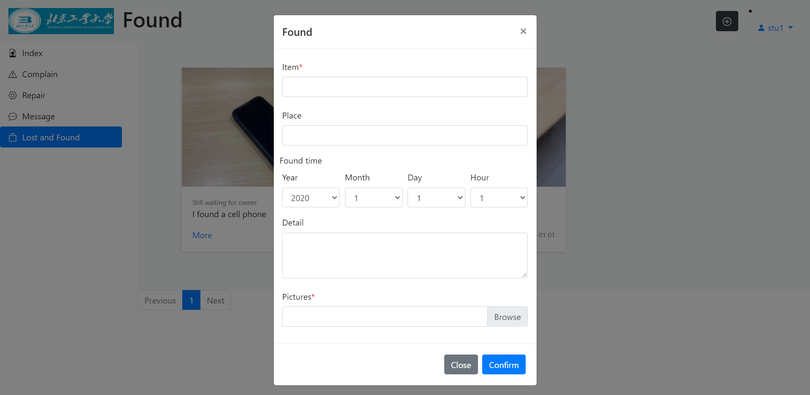
*post a 'found' information*

*detailed information of a found item*

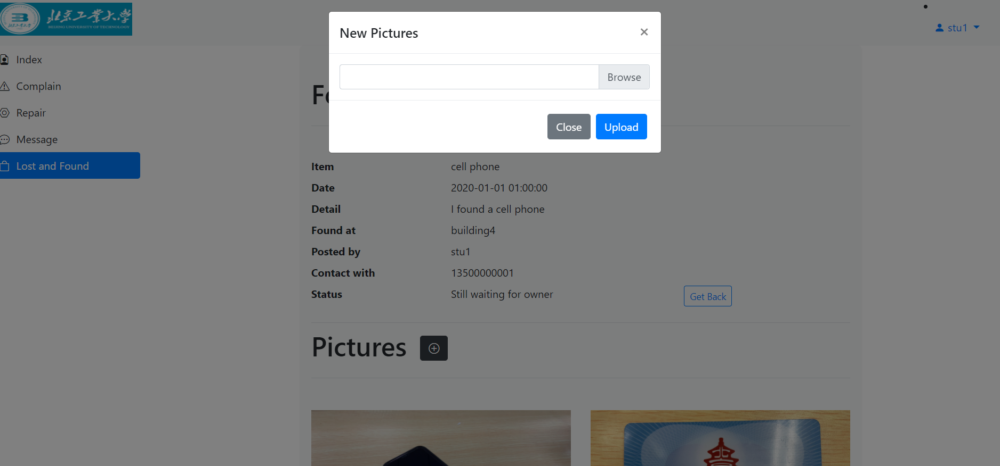
*the author can add more pictures*

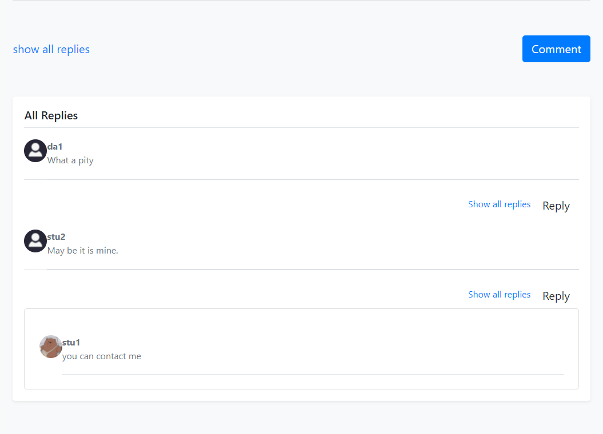
*the comment system*

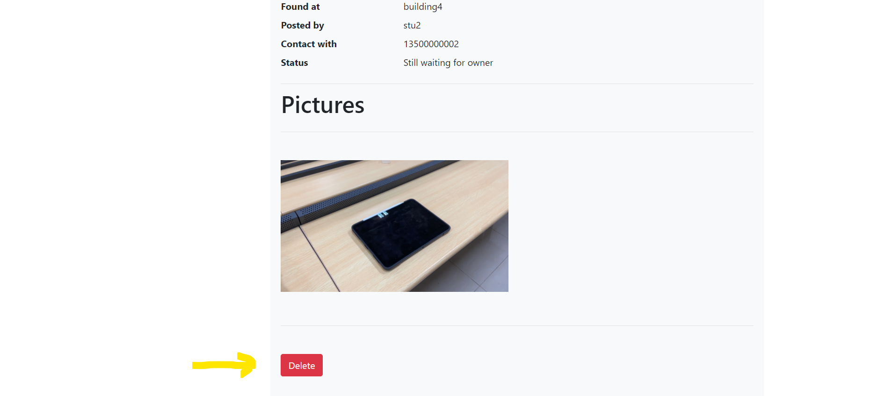
*system administrators can delete the information*

### Feature 6: Data Visualization
For dorm administrators and system administrators, we have provided them the functionality
of data visualization. For example, the student information can detailed information in a
specific building can be shown in the tables, pie charts, line charts, bar graphs etc.

#### A basic appearance of this function has been shown below: 
(we take the function for system administrator as an example)

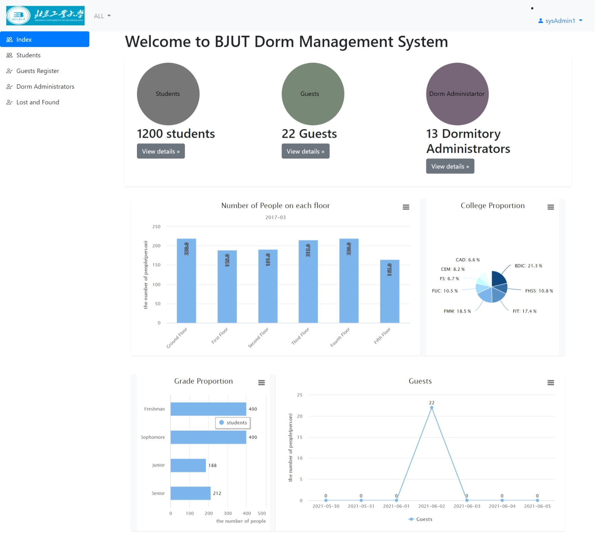
*the data visualization for a system administrator*

As shown in the picture above.  
1. The total number information are shown at the top of the page.
2. There is a bar chart showing the number of students living on each floor in the selected dorm building.
3. A pie chart shows the proportion of students in each college in the selected building.
4. There is also a bar chart showing the number of students in different stages in the selected building 
5. Finally, there is a line chart showing the nearly 7 days' tendency of the number of guests in the selected building.